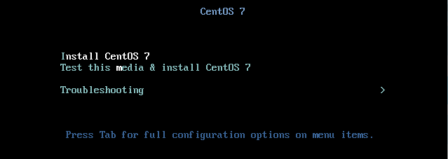

Como instalar CentOS 7 desde cero para un server
=====================================

Lo primero que nos mostrará será un menú que nos indica como queremos realizar la instalación, y elegiremos la opción Install Centos 7:

Luego elegiremos el idioma con que queremos que se realice la instalación, en nuestro caso español:

Seleccionamos la opción que dice destino de la instalación:

Luego donde dice otras opciones de almacenamiento, seleccionamos "Voy a configurar las particiones" para entender mejor el particionado:

.. image:: ../imagenes/Instalacion_CentOS/016.png

Configuramos todas las particiones, con la premisa de que la partición var sea la que tenga mayor espacio, y la swap dependerá de la ram. Sí la ram está entre 1 y 2 GB, la swap sera 1,5 veces la ram; y si esta entre 2 a 8 GB, la memoria de intercambio debe ser igual a la ram. Es recomendable asignar los espacios, antes de empezar el particionado. En este caso así quedo nuestro particionado en una máquina virtual de 8 GB de disco y 1 GB de ram:

Luego nos dará un resumen den los cambios que debemos verificar y aceptar:

Se debe configurar la cuenta de root y crear un usuario aparte:

Le asignamos la contraseña al usuario root:

Luego se crea una cuenta de usuario alternativa a la de root, para ser usada en tareas que no sean administrativas:

Luego verificamos en AJUSTES DE USUARIOS y ya aparecen las nuevas configuraciones:

Continuamos el proceso de instalación y luego de concluida la carga, se nos informará que se ha instalado CentOS y que debe reiniciar para poder usuarlo:

